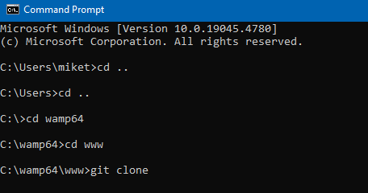
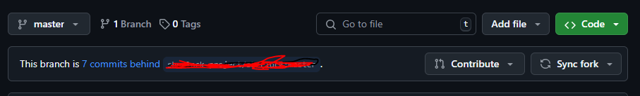

#### Please see Base64.php and Base64History.php for comments explaining the code

Warning, You should not be having to mess with Database.php or init.php you simple just include the init.php and it
should take care of the rest of the database connection by itself.

# Installation

### Remember to keep your fork synced with mines and create pull requests with stuff you added.. This repo is the head repo and this ensures we are not working on the same thing twice or more

Fork this repository to your own GitHub and set visibility to private!!

Install git onto your own computer

Open command prompt

CD to the WAMP www directory

```bash
    cd ..
    cd ..
    cd wamp64
    cd www

```



#### Install the GitHub repo

Change 'USERNAME' to your GitHub username

```bash
    git clone https://github.com/USERNAME/Consolidev.git
```

Don't worry about the pics directory and the .md files these are here for documentation!!!!

### It should now work, and you should be able to see it from WAMP

# See Installing database schema file:

https://github.com/MR-VL/Consolidev/blob/bed371c27ec4dbb9c7d12df41d1fd490d4c0f164/SQL_DUMP/SQLDUMP.md

## Write code and make sure it works before submitting PR

# Please keep an eye on the Issues tab on GitHub!!!


### if you have issue you are more than welcome to open an issue, and assign someone to it or not.... <br> But please do try and use the issues tab it makes it easier to manage everything going on..

### If I missed something while typing this you can add it yourself by doing a pull request or just create an issue and tell me what you want and ill do it!

# TroubleShooting

#### See the troubleshooting readme..

https://github.com/MR-VL/Consolidev/blob/21bb69519b1e63745a0dd26bda0921077a299696/Troubleshooting.md<br>
If you run into any issues and you find a successful fix to the problem please list it on there and what to do to
resolve the issue.
So if any of us run into the same issue we can save time instead of having to research it ourselves.

### Seriously if you find and issue and solution to it PUT IT IN THERE

# To push changes.

# Note !! If you are having to force push stuff then you are making an error somewhere or not properly handling a merge conflict...

## If you already know how to do this then do it the way you know

## there are multiple ways to do this step!

#### open command prompt/terminal from IDE

```bash
    git add .
    git commit -m "WRITE WHAT YOU DID HERE"
    git push --all
```

From there you go to your GitHub repository, and it will ask you if you want to
contribute, click yes or whatever it wants.


```markdown
Create a pull request.
```

It should automatically populate everything and I will merge them myself or give
feedback as to why it wasn't merged.

# Sync Fork with Main

### Go to GitHub.com and your repository

## Click on sync fork and update branch


## Go to your IDE or command prompt

```bash
git pull origin main
```

### Your local computer fork should now be synced with the MAIN branch from GitHub
