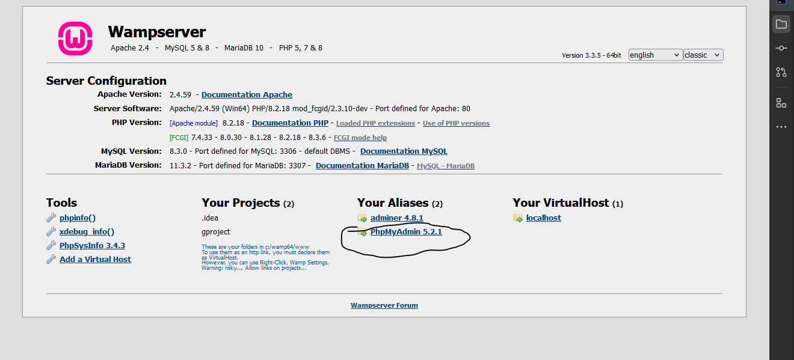
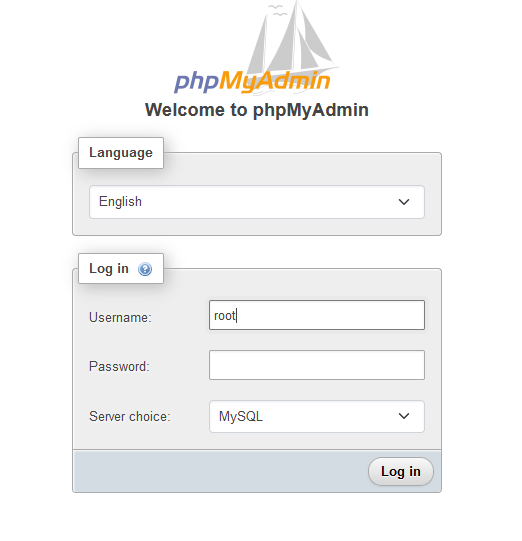
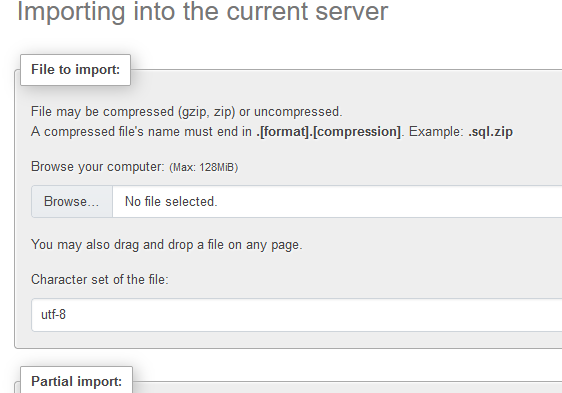
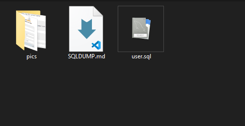

## IMPORTING Database

From the SQL DUMP folder grab all the sql files

go to phpmydmin

```markdown
Localhost 
click on PhpMyAdmin
```


### Login credentials:<br>
username = root
<br> LEAVE PASSWORD FIELD BLANK<br>



Once logged in Click on Import tab and upload the SQL file you want



<br><br><br>
# Exporting database
### This is only necessary if you made a change such as added a new table
### if you did not add table and only did php/html
## This step is not required for you
##  Just submit your pull request as normal

# Exporting steps:
## Click on the main Database in the left corner of phpmyadmin
# You should only have 1 sql file exported
### Both the export method and format should be left to QUICK and SQL

Download the file

#### Move the file into the project folder inside the SQLDUMP subfolder<br>
Do not worry about the SQLDUMP file or the pics folder

### Your folder should look something like this.<br>
We may have more files in the future, this is just documentation<br>


# Upload everything else and create pull request

